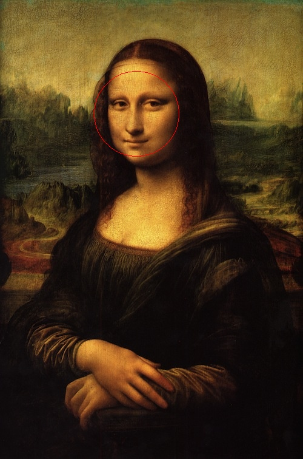

# node-opencv-amqp


```
docker run -ti \
  --add-host="rabbitmq:192.168.178.21" \
  -e "RABBITMQ_HOST=amqp://rabbitmq:5673" \
  -v /Users/marcel/projects/node-opencv-amqp:/data \
  --entrypoint bash \
  martin72/node-opencv-amqp
```
```
cat /node_modules/opencv/examples/files/mona.png | amqp-publish -u `echo $RABBITMQ_HOST` -e images
```
